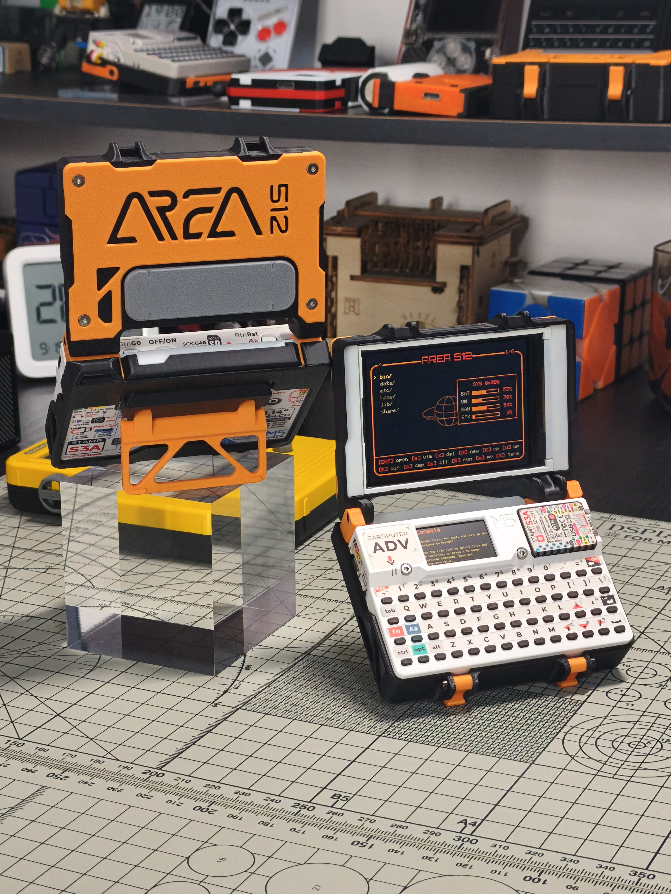

# TERM512: CardputerAdv Expansion Kit for AREA512 Firmware

TERM512 is a custom expansion kit for the CardputerAdv, tailored specifically for the [AREA512](https://github.com/engneer-hamachan/area512) firmware. It is designed to reshape the CardputerAdv into a cyberdeck that fully aligns with the visual aesthetics of AREA512, serving as the dedicated physical hardware platform for the project

Of course, this kit is essentially a stylized CapTFT expansion module, and adaptations for other firmwares are always welcome

The kit consists of the following components:

- **Custom-Designed CapTFT Enclosure**: Redesigns the top lid based on [CapTFT V2](https://github.com/Prokuon/CardputerADV_Cap_TFT_V2), and increases the maximum screen opening angle from 120° to 135°;
- **Protective Base**: Secured via two of the LEGO-compatible holes on the bottom of the CardputerAdv. It integrates two latches to lock the screen lid securely in place when closed, along with a lanyard hole;
- **Adjustable Kickstand**: Installed using the remaining two LEGO-compatible holes on the bottom. The hinge damping can be tuned via the adjustment bolt

## BOM List

1. 3D printed shell D1
2. 3D printed shell C2
3. 3D printed shell C3
4. 3D printed shell D2
5. 3D printed shell D3
6. 3D printed shell R1
7. 3D printed shell L1
8. 3D printed shell S1
9. 3D printed shell C1
10. 3D printed shell B1
11. 3D printed shell T1 - 2 pieces
12. 3D printed shell K1
13. 3D printed shell K2
14. 2.8 inch ILI9341 display
15. M2x6 hex socket flat head bolts - 4 pieces
16. M2x5 hex socket cap bolts - 3 pieces
17. M2x10 hex socket cap bolts - 4 pieces
18. 2.54mm 2x7P dual-row straight pin header
19. Power supply module (AMS1117-3.3V)

To improve the reproducibility of this project, two versions of the design are provided: TypeA fits displays with a blue PCB, and TypeB fits displays with a black PCB. Please print the corresponding model files based on your display selection

Blue PCB display reference image

Black PCB display reference image

Power supply module reference image

## Assembly Instructions

Attach the power supply module to the back of the display, and connect the display to the pin header using thin wires as shown in the diagram. It is recommended to use cable with an outer diameter of 0.65mm. For the wiring definition, please refer to the table below

The black PCB display has one fewer pin than the blue PCB display (no BLK), while the definitions and order of the remaining pins are exactly the same as the blue PCB display. You can also refer to the table for wiring

Display

| GND  | VCC  | SCL  | SDA  | RES  | DC   | CS   | BLK  |
| :--: | :--: | :--: | :--: | :--: | :--: | :--: | :--: |
| 1    | 2    | 3    | 4    | 5    | 6    | 7    | 8    |

Power supply module

| VIN  | VOUT |
| :--: | :--: |
| 10   | 2, 8 |
| GND  | GND  |
| 9    | 1    |

CardputerADV

| G3   | G4   | G6   | G40  | G14  | G39  | G5   |
| :--: | :--: | :--: | :--: | :--: | :--: | :--: |
| 5    | x    | 6    | 3    | 4    | x    | 7    |
| 5VIN | GND  | 5VOUT| SDA  | SCL  | G13  | G15  |
| x    | 9    | 10   | x    | x    | x    | x    |

Install C2 and C3 onto D1. Note that C3 needs to be secured with glue

Install the display onto D1

Use 4 M2x6 hex socket flat head bolts to install D2 and D3 onto D1

Install the pin header onto S1

Use 1 M2x5 hex socket cap bolt to assemble C1 and S1

Install L1 and R1 onto D1, and use 2 M2x5 hex socket cap bolts to install L1 and R1 onto S1

Use 2 M2x10 hex socket cap bolts to assemble T1 and B1

Use 2 M2x10 hex socket cap bolts to assemble K1 and K2

## Credits

- **[engneer-hamachan](https://github.com/engneer-hamachan)**: Thanks for adding official CapTFT support to the [AREA512](https://github.com/engneer-hamachan/area512) firmware. The design of TERM512 was directly inspired by AREA512's visual aesthetic and worldbuilding
